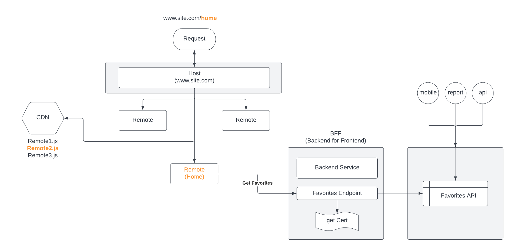

# Microfrontends using Module Federation and React
This is an example application using react (and webpack) as a host, and create react application as remotes. These are dynamically resolved in each next page route, and defined either ssr true/false.

Note: This solution architecture is for use with a mono repo only.

## TODO
- Finish docker support
- Share state at host level to remotes using context

## Structure

For now we will keep the structure loose and simple:

```
├─── 📁 host                > React Host
│    ├─── 📁 layout         > Shared layout
│    └─── 📁 pages          > Routing
│
├─── 📁 remotes
│    ├─── 📁 home           > React Remote using JSX
│    ├─── 📁 profile        > React Remote using Typescript
│    └─── 📁 sample         > React Remote using JSX
│
├─── 📁 service             > Backend-for-Frontend express api
│
├─── 📁 shared              > Packages and components shared across remotes
```


## Diagram

 

## What are hosts and remotes?

When we talk about micro-frontends or micro-sites, we often use words like HOST and REMOTE. A remote is a single page react application. A host is a parent application that ties all remotes together.

Often time a host can extend configuration, security, types, routing, and many other features to remotes, so that each remote does not have to implement them individually.


## What is the shared folder for?

This is a great place to hold utilities, hooks, components, etc for remotes and hosts to use whenever needed. This does not replace the need for a npm repository, but does allow you to share components across remotes without the need to publish a npm package thats really only used for your application.

## Getting started
Ive really worked hard to keep this extremely simple to stand up.

```bash
$ npm install
$ npm start
```

Now you may visit `http://localhost:3000` in a browser.

## What is this shared directory?

This is where we store functionality, modules, components, etc... that are shared across remotes. If it doesnt need to be shared, keep it within the remote.

## Adding a new remote
If you need to add a new remote, its quite easy. 

1) Create a new react application in the remotes folder.
2) Create or copy your webpack config.
3) Add your new remote to `host/.env`.
4) Create a page route in `host` and inject your remote!
5) Run your host using `npm start`.

Thats it, you should be ready to go.

## Deploying the remotes

When we deploy the host to a container or app service, we rarely will need to re-deploy the host. This is because the host use http to resolve the remotes, so we simply need to deploy the remotes to a CDN. The host has config telling it where to get the remotes! Cool huh?

## Building and deploying the container

If you want to deploy this, we first need to build the container so that it can be ran anywhere you can host a docker container. To do this you simply run this command `npm run container build`.

This is an easy way to build the container image for demployment wherever container orchestration is available to you.

If you would like to run this container locally, just run: `npm run container:run`.
