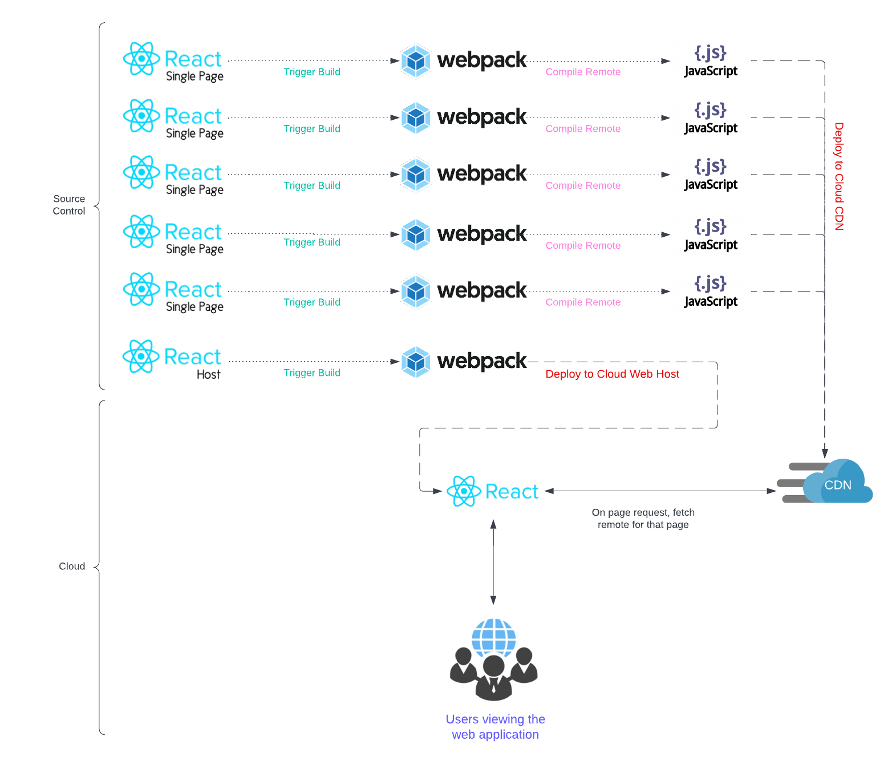

# Microfrontends using Module Federation and React
This is an example application using react (and webpack) as a host, and create react application as remotes. These are dynamically resolved in each page route, and defined either ssr true/false.


## What is a Microfrontend Architecture?

Microfrontend architecture is an approach to breaking up your front-end into a set of independently deploy-able, loosely coupled applications and/or components. These applications are then assembled together to act as a single user experience, once deployed.

## What is module federation?

When we talk microfrontends, we generally need to load applications individually asynchronously only when requested. We do this by using a feature known as Module Federation to create a single deployable artifact of an application, which can be loaded on demand. 

More Information: [Documentation](https://webpack.js.org/concepts/module-federation/)

## What are hosts and remotes?

When we talk about micro-frontends or micro-sites, we often use words like `HOST` and `REMOTE`. A remote is a single page react application. A host is a parent application that ties all remotes together.

Often time a host can extend configuration, security, types, routing, and many other features to remotes, so that each remote does not have to implement them individually.

Lets take a quick look at the folder structure before we get too deep.

## Solution Structure

For now we will keep the structure loose and simple:

```
├─── 📁 host                > React Host
│    ├─── 📁 layout         > Shared layout
│    └─── 📁 pages          > Routing
│
├─── 📁 remotes
│    ├─── 📁 home           > React Remote using JSX
│    ├─── 📁 profile        > React Remote using Typescript
│    └─── 📁 sample         > React Remote using JSX
│
├─── 📁 service             > Backend-for-Frontend express api
│
├─── 📁 shared              > Packages and components shared across remotes
```

## What is the shared folder for?

This is a great place to hold utilities, hooks, components, etc for remotes and hosts to use whenever needed. This does not replace the need for a npm repository, but does allow you to share components across remotes without the need to publish a npm package thats really only used for your application.

## What is the service folder?

A common pattern for microfrontends is to include a (BFF) backend-for-frontend service. This can be as simple as a ExpressJS api or a collection of lambda functions. This is also not a requirement of the architecture. For this code example, I included an ExpressJS instance just to get you started.

Once running, visit: `http://localhost:8080/api-docs/`

A BFF can be responsible for handling much of the business logic around fetching and updating data to your services. For our example we will derive remote configuration data from this api. You can replace this with any mechanism later. This allows all remotes to share a single layer of abstraction to avoid each remote dusplicating implementation to common backend services.


## Getting started
Ive really worked hard to keep this extremely simple to stand up.

```bash
$ pnpm i
$ pnpm start
```

Now you may visit `http://localhost:3000` in a browser.

## Architecture



## Typical Layout


## Typical Workflow

 


## What is this shared directory?

This is where we store functionality, modules, components, etc... that are shared across remotes. If it doesnt need to be shared, keep it within the remote.

## Adding a new remote
If you need to add a new remote, its quite easy. 

1) Create a new react application in the remotes folder.
2) Create or copy your webpack config.
3) Add your new remote to `host/.env`.
4) Create a page route in `host` and inject your remote!
5) Run your host using `npm start`.

Thats it, you should be ready to go.

## Deploying the remotes

When we deploy the host to a container or app service, we rarely will need to re-deploy the host. This is because the host use http to resolve the remotes, so we simply need to deploy the remotes to a CDN. The host has config telling it where to get the remotes! Cool huh?

## Building and deploying the container

If you want to deploy this, we first need to build the container so that it can be ran anywhere you can host a docker container. To do this you simply run this command `npm run container build`.

This is an easy way to build the container image for demployment wherever container orchestration is available to you.

If you would like to run this container locally, just run: `npm run container:run`.
